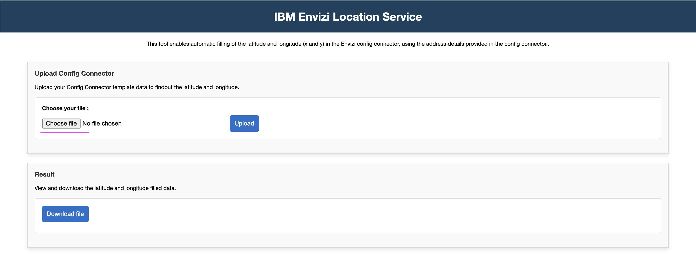
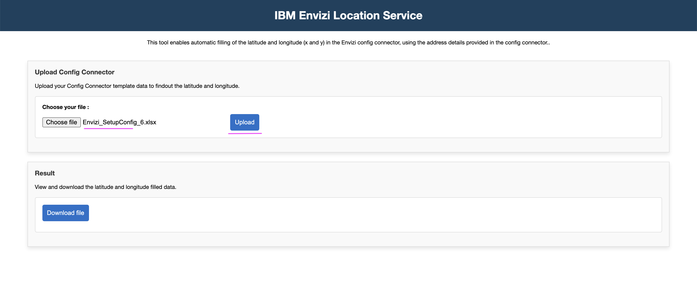
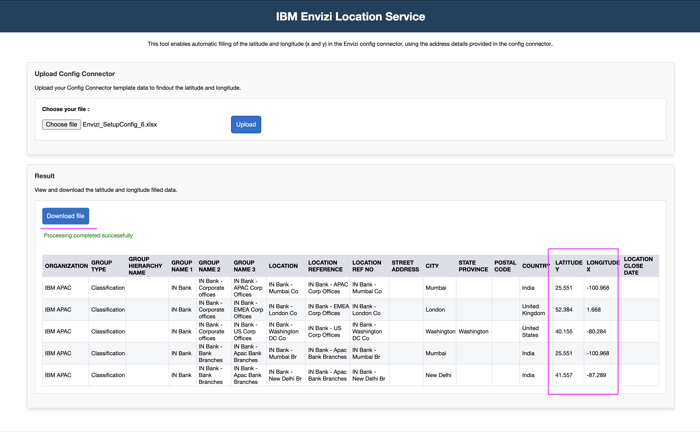

# Envizi Location Service

Helps to fill in the `LATITUDE Y` and `LONGITUDE X` columns of the Envizi Setup Config template.

## How to run the application

To run the application follow the below steps. 

### Prerequisite

Python should be available.

### 1 Download the repo

1. Download this repo

### 2 Create .env file

1. Goto to the root folder of the repo.

2. Create `.env` file with the below entries. 

3. Update all the properties accordingly.

```
# Environment variables
LOGLEVEL = INFO

LOCATION_API_URL = "https://api.weather.com/v3/location/search"
LOCATION_API_KEY = ""

OUTPUT_FOLDER = "output"
WRITE_INTERIM_FILES=TRUE
```

### 3  Install python modules

1. Run the below command to create virutal environment and instal the required python modules.
```
python -m venv myvenv-location-service
source myvenv-location-service/bin/activate

python -m pip install -r requirements.txt
```

### 4  Start the app

1. Runs the below command to start the app.

```
python main.py
```

### 5  Run the app

1. Open the url http://localhost:5001/ in the browser

2. Click on `Choose file` button to select your config connector template. 

You can use the file - [data/Envizi_SetupConfig_6.pdf](../data/Envizi_SetupConfig_6.pdf)  



3. The selected file might look like this: it includes some filled address-related fields, but the latitude and longitude fields are left blank


4. Click on `Upload` to send the selected file to the server for the processing.



5. The file got processed the latitude and longitude fields are filled with the appropriate values based on the address-related fields.

6. Click on `Download file` button to download the processed excel file.



7. You can see the downloaded file contains the latitude and longitude fields values.


The sample file is available here - [data/Envizi_SetupConfig_6_result.pdf](../data/Envizi_SetupConfig_6_result.pdf)  

